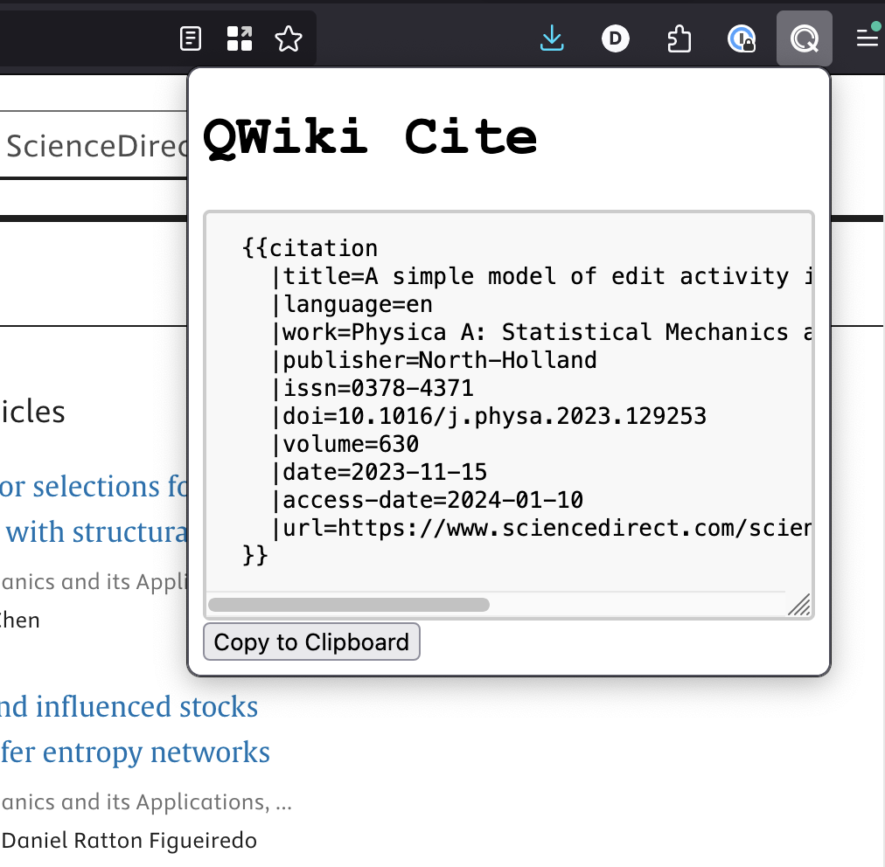

# QWiki-Cite
**[Install on Firefox](https://addons.mozilla.org/en-US/firefox/addon/qwiki-cite/)**



This is a tiny browser extension that can automatically generate a Wikipedia `{{citation}}`
template for whatever page you are currently on.

## Features
* scrape details of the current page including title, author, published date, etc
* grab the most-recent archive of the page from the Wayback Machine
* escapes reserved characters for you
* quickly copy the template to your clipboard with one button click
* also supports academic journals and books

Scraping is done by looking at the current page and parsing the following sources of metadata:

* [schema.org json+ld](https://schema.org/) metadata blobs
* [DCMI](https://www.dublincore.org/specifications/dublin-core/dcmi-terms/#section-2) metadata tags
* a bunch of common HTML `<meta/>` tags
* other HTML elements

## Compatibility
I only bother testing this on Firefox. If you're using Chrome it _might_ work but I don't guarantee it.

Automated tests are included for some websites to check that scraping works as expected on them.
The set of supported websites will continue to expand as I develop the extension. Even if a website
isn't directly supported, the extension will work on most websites.

## Development
This is written in Typescript and packed with Parcel.

Install the project:
```
yarn install
```

Watch your local changes and build automatically:
```
yarn watch
```

You can then install it in Firefox by going to `about:debugging` and installing a
temporary extension. Firefox even automatically reloads when you make changes!

Compile and bundle the project:
```
yarn build
```

Run unit tests:
```
yarn test
```
