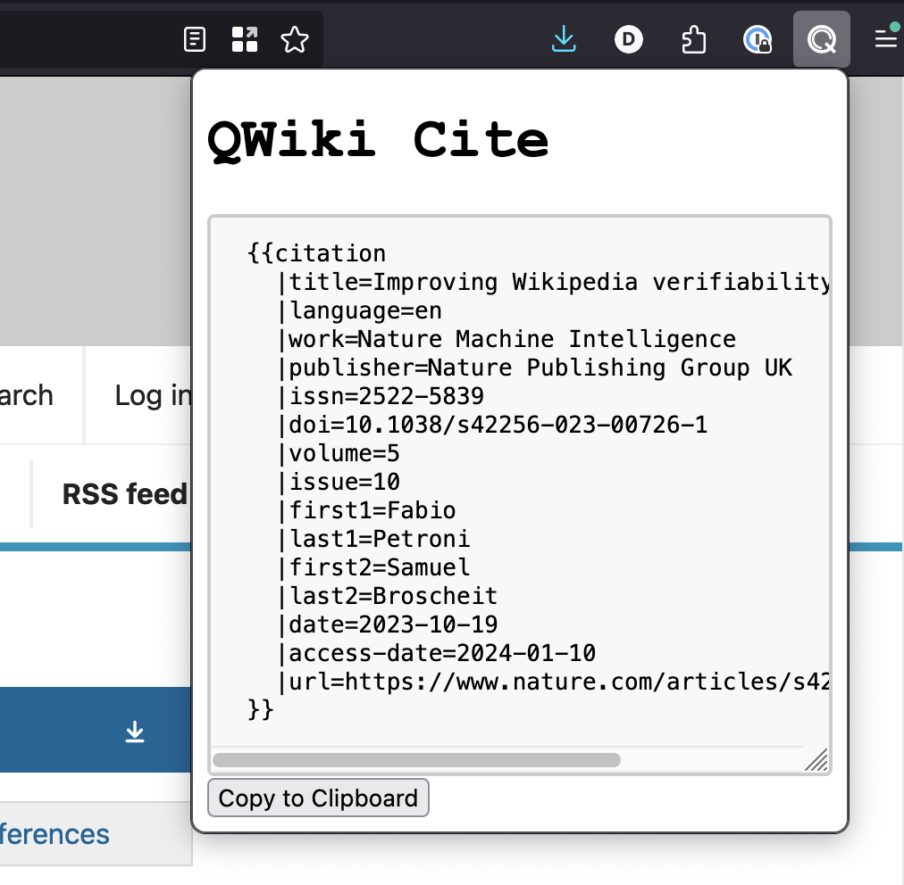

# QWiki-Cite
**[Install on Firefox](https://addons.mozilla.org/en-US/firefox/addon/qwiki-cite/)**



This is a tiny browser extension that can automatically generate a Wikipedia `{{cite web}}`
template for whatever page you are currently on.

## Features
* scrape details of the current page including title, author, published date, etc
* grab the most-recent archive of the page from the Wayback Machine
* escapes reserved characters for you
* quickly copy the template to your clipboard with one button click

## Compatibility
I only bother testing this on Firefox. If you're using Chrome it might work.

## Development
This is written in Typescript and packed with Parcel.

Install the project:
```
yarn install
```

Watch your local changes and build automatically:
```
yarn watch
```

You can then install it in Firefox by going to `about:debugging` and installing a
temporary extension. Firefox even automatically reloads when you make changes!

Compile and bundle the project:
```
yarn build
```

Run unit tests:
```
yarn test
```
